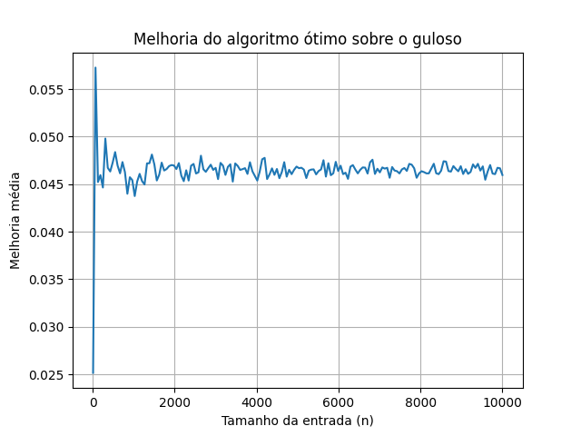

# 🏭 Problema: Linha de Montagem

## 🎯 Objetivo

Comparar o desempenho de dois algoritmos para o problema da **linha de montagem**:
- ✅ Um **algoritmo de programação dinâmica** (ótimo)  
- ⚠️ Um **algoritmo guloso ingênuo**

O foco é avaliar **tempo de execução** e a **qualidade da solução** de ambos os métodos.

---

## 📊 Resultados Experimentais

### 📈 Gráfico 1 — Tempo de Execução

Este gráfico mostra o tempo que cada algoritmo levou para resolver instâncias de diferentes tamanhos.

### 📉 Gráfico 2 — Melhoria do Algoritmo Ótimo sobre o Guloso

Este gráfico mostra o quanto a solução do algoritmo ótimo (programação dinâmica) é melhor que a do guloso em termos de tempo total da linha de montagem.

